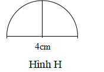
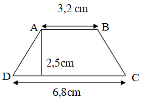
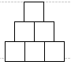

## 1
I. PHẦN TRẮC NGHIỆM (4 điểm)

Khoanh vào chữ cái trước câu trả lời đúng

Câu 1. 86,15 : 0,001 = …….. Số điền vào chỗ chấm là:

A. 0,08615

B. 861,5

C. 8,615

D. 86150

Câu 2. 7052 cm3 = ......dm3 Số thích hợp điền vào chỗ chấm là:

A. 7,052

B. 70,52

C. 705,2

D. 0,7052

Câu 3. Quãng đường từ nhà lên huyện dài 35 km. Trên đường đi từ nhà lên huyện, một người đi bộ 10 km rồi tiếp tục đi xe ô tô trong nửa giờ nữa thì đến nơi. Vậy vận tốc của ô tô là:

A. 70km/giờ

B. 60km/giờ

C. 50km/giờ

D. 25km/giờ

Câu 4. Tam giác ABC có độ dài đáy là 16 cm, chiều cao tương ứng bằng một nửa độ dài đáy. Diện tích tam giác ABC là:

A. 128 cm2

B. 32 cm2

C. 6,4 dm2

D. 64 cm2

Câu 5. Cho nửa hình tròn H có đường kính 4cm (như hình vẽ).

Chu vi hình H là:

A. 12,56 cm

B. 10,28 cm

C. 16,56 cm

D. 6,28 cm

Câu 6. Diện tích hình thang ABCD (hình vẽ bên) là:

A. 125 cm2

C. 12 cm2

B. 12,5 cm2

D. 25 cm2

Câu 7. Điền số hoặc chữ thích hợp vào chỗ chấm:

5m3 103dm3 = ……….m3

48 phút …………. = 0,8 giờ

2m2 5dm2 = ………….m2

3 ngày 16 giờ = ……….ngày

II. PHẦN TỰ LUẬN (6 điểm)

Bài 1. (2 điểm) Đặt tính rồi tính

a. 23 phút 25 giây – 18 phút 56 giây

b. 8 giờ 20 phút : 5

c. 3 phút 15 giây + 2 phút 48 giây

d. 5 giờ 22 phút x 3

Bài 2. (1 điểm) Tìm x biết: 61,4 - x = 216,72 : 4,2

Bài 3. (2 điểm) Một bể chứa nước dạng hình hộp chữ nhật có kích thước trong lòng bể là: chiều dài 3m, chiều rộng 1,5m và chiều cao là 1,2m.

a) Hỏi bể đó chứa được bao nhiêu lít nước? (1dm3 = 1 lít)

b) Tính chiều cao mực nước trong bể hiện tại Biết hiện tại lượng nước chiếm 60% thể tích bể.

Bài 4. (1 điểm)

a) Tính bằng cách thuận tiện:

1 giờ 45 phút x 3 + 6 x 1,75 giờ + 105 phút

b) Một bạn học sinh dùng các khối lập phương xếp thành một cái tháp như hình dưới đây. Em tính giúp bạn xem để xếp được tháp cao 8 tầng thì cần chuẩn bị bao nhiêu khối lập phương.
